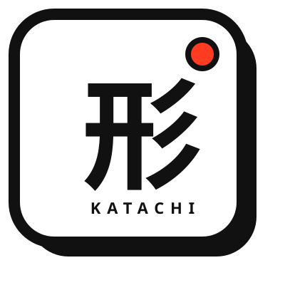

<p align="center">
  
</p>

<h1 align="center">Katachi</h1>

<p align="center">
  A local-first Japanese conjugation practice app for JLPT learners.
</p>

<p align="center">
  
  
  
  
  
  
  
</p>

Katachi runs as a Next.js App Router application, can be installed as a PWA, and optionally syncs study progress through Supabase without making cloud access required for practice.

## What It Does

- Builds daily, weakness-focused, and free practice sessions from the local dictionary.
- Supports multiple-choice recognition and typed active-recall answers.
- Generates plausible distractors for incorrect choices while excluding the correct answer.
- Re-queues missed items so a session finishes only after every original item is answered correctly.
- Tracks streaks, daily goals, unit progress, form mastery, pattern mastery, word stats, session history, and attempt history locally.
- Provides a progress dashboard with weakest forms, weakest items, recent activity, and drill shortcuts.
- Plays Japanese audio with browser TTS fallback and keeps audio failures non-blocking.
- Supports English, Chinese, Vietnamese, Nepali, Burmese, and Korean UI/localized meanings.
- Works in guest mode by default and can sync progress after Supabase sign-in.
- Ships PWA metadata, icons, iOS install guidance, a splash overlay, and a Serwist service worker for production builds.

## Tech Stack

- Next.js 16 App Router with React 19 and TypeScript
- Tailwind CSS 4
- Zustand with `localStorage` persistence
- Supabase Auth and `study_states` sync
- Serwist for PWA service worker generation and runtime caching
- WanaKana for romaji-to-hiragana input normalization
- Vitest and ESLint

## Getting Started

### Prerequisites

- Node.js 20.9 or newer is required by Next.js 16.
- Yarn 1.22.22 is the canonical installer because `yarn.lock` is the committed lockfile. Project scripts are still invoked through npm below.

### Install

```bash
yarn install --frozen-lockfile
```

### Run Locally

```bash
npm run dev
```

Open <http://localhost:4399>. The development script intentionally runs Next.js with Webpack because the PWA build path depends on Serwist.

### Build and Start

```bash
npm run build
npm run start
```

`npm run build` creates the production Next.js build and generates `public/sw.js` from `src/app/sw.ts`.

## Environment

Katachi is usable without any environment variables. Supabase only enables online account and sync features.

Create a local `.env.local` when you want sync:

```bash
NEXT_PUBLIC_SUPABASE_URL=
NEXT_PUBLIC_SUPABASE_ANON_KEY=
NEXT_PUBLIC_ENABLE_GOOGLE_AUTH=false
NEXT_PUBLIC_SITE_URL=https://your-production-domain.example
```

`NEXT_PUBLIC_SITE_URL` supplies canonical, Open Graph, robots, sitemap, and structured-data URLs. Vercel's production URL is used as a fallback, but an explicit custom-domain value is recommended.

`NEXT_PUBLIC_ENABLE_GOOGLE_AUTH=true` enables Google OAuth in addition to email OTP sign-in. Keep these as public browser keys only; do not add service-role credentials to client code.

## Supabase Setup

1. Create a Supabase project.
2. Add `NEXT_PUBLIC_SUPABASE_URL` and `NEXT_PUBLIC_SUPABASE_ANON_KEY` to `.env.local`.
3. Apply the study-state migration:

```bash
supabase/migrations/20260423000000_create_study_states.sql
```

4. Check that the table is reachable:

```bash
npm run check:supabase
```

The app stores progress locally first. When a user signs in, `src/lib/supabase/studySync.ts` merges local and remote `StudyState` conservatively so remote data does not erase guest progress.

Before enabling auth in production:

- Set Supabase **Site URL** to the exact production origin.
- Allowlist the exact `https://your-production-domain.example/auth/callback` redirect. Use wildcards only for preview deployments.
- Configure the email OTP template to show `{{ .Token }}` because the UI asks users to enter the code.
- Configure production SMTP and review Supabase Auth rate limits before onboarding real users.

## Project Structure

```text
src/app/                    Next.js routes, metadata, PWA config tests, service worker source
src/components/             Practice UI, auth UI, install prompt, splash screen, progress panels
src/lib/                    Store, session builder, distractor engine, i18n, audio, study logic
src/lib/study/              Study-state types, migration, scheduling, scoring, statistics
src/lib/supabase/           Supabase client, auth callback helpers, sync and database types
src/data/dictionaries/      Main dictionary and localized meanings
public/                     Manifest, icons, generated service worker output
scripts/                    Supabase check and icon generation utilities
docs/                       Learning architecture and feature design notes
supabase/migrations/        Database schema for optional progress sync
```

## Core Concepts

### Local-First Study State

Durable progress lives in `studyState` inside `src/lib/store.ts` and persists under `katachi-storage`. `activeSession` is transient session state. Legacy aliases such as `dailyStreak`, `lastPracticeDate`, `progress`, `language`, and `config` are kept coherent for older persisted data.

If the `StudyState` shape changes, update the migration path in `src/lib/study/migrate.ts` and add focused tests.

### Practice Sessions

`src/lib/sessionBuilder.ts` selects practice units from the dictionary and learner history. Daily sessions honor the remaining daily budget, weakness sessions prioritize low-performing units, and free sessions use the selected configuration. Incorrect answers are recorded and re-queued by the store/session flow.

### Dictionary Data

The dictionary files are structured JSON. Word ids are stable because progress and sync depend on them. Prefer generation or scripted transformations over manual edits to large dictionary files.

### PWA Behavior

PWA support is production-only:

- `next.config.ts` wraps Next with `@serwist/next`.
- `src/app/sw.ts` is the editable service worker source.
- `public/sw.js` is generated and should not be hand-edited.
- `public/manifest.json` and `src/app/layout.tsx` must stay aligned for app metadata and icons.
- iOS install behavior is handled by `src/components/IOSInstallPrompt.tsx`.

Run a production build after changing PWA, metadata, routing, or static assets.

## Scripts

```bash
npm run dev              # Start the development server on port 4399
npm run build            # Create a production build and generate the Serwist service worker
npm run start            # Start the production server
npm run lint             # Run ESLint
npm run test             # Run Vitest once
npm run test:watch       # Run Vitest in watch mode
npm run check:supabase   # Verify the Supabase study_states table
npm run generate:icons   # Regenerate PNG icons from public/icon.svg
```

## Testing

Run focused tests for the area you changed:

```bash
npm run test -- src/lib/store.test.ts
npm run test -- src/lib/sessionBuilder.test.ts
npm run test -- src/lib/study/migrate.test.ts
npm run test -- src/lib/supabase/studySync.test.ts
npm run test -- src/app/pwa-config.test.ts
npm run test -- src/components/IOSInstallPrompt.test.ts
```

Use broader checks before shipping shared-state, routing, persistence, or PWA changes:

```bash
npm run lint
npm run test
npm run build
```

## Development Guidelines

- Keep guest mode fully usable without network access or Supabase credentials.
- Add all user-facing app strings to every supported language in `src/lib/i18n.ts`.
- Use `useTranslation(language)` for client UI tied to persisted language.
- Keep audio/TTS failures non-blocking for practice.
- Use `lucide-react` icons when an icon is needed.
- Preserve mobile, standalone PWA, and safe-area behavior when changing layout.
- Do not add required network calls to the practice path.
- Regenerate generated assets instead of hand-editing them.

## Deployment Notes

The app can be deployed like a standard Next.js application. For PWA correctness, make sure the deployment runs:

```bash
npm run build
```

Set the Supabase public env vars only if online sync is desired. Without them, the app hides account controls and continues in local mode.

For a production release:

- Set `NEXT_PUBLIC_SITE_URL` to the final HTTPS origin.
- Run `yarn install --frozen-lockfile`, `npm run lint`, `npm run test`, and `npm run build`.
- If sync is enabled, apply the migration, run `npm run check:supabase`, and verify the production auth redirect and OTP email template.
- Add platform-level rate limiting for `/api/tts`; the in-process limiter is a best-effort safeguard and is not shared between server instances.

## Changelog

See [CHANGELOG.md](./CHANGELOG.md) for release history.
